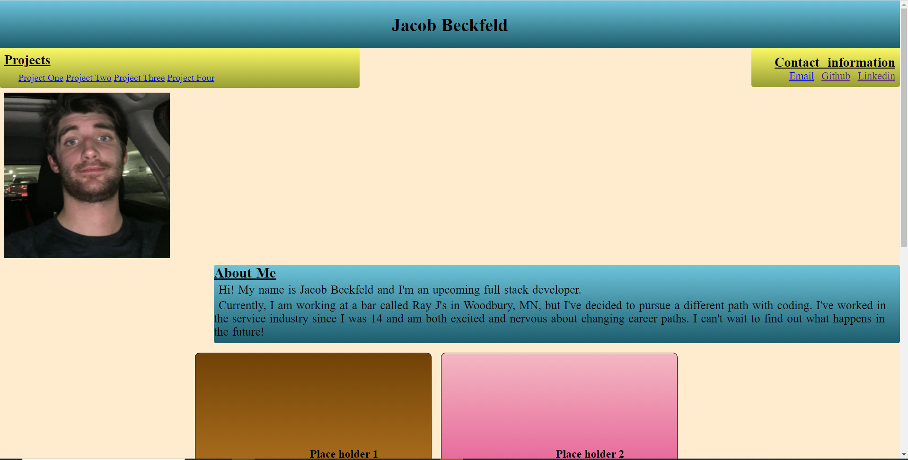

# Portfolio
This is an example of what my portfolio could look like.
It has a recent photo, all my contact information and some placeholders for where projects i will eventualy will make would go.
It also has and about me section with a short discription that can be improved upon.
I used both loats and flex for styling the page.

https://jacobbeckfeld.github.io/Portfolio/

 